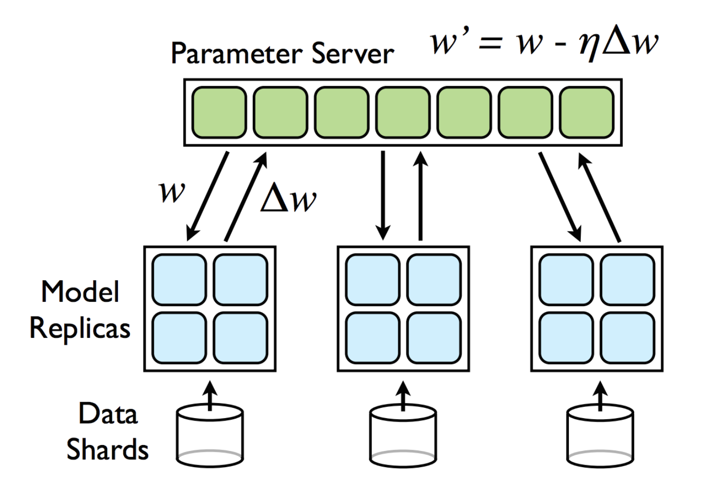
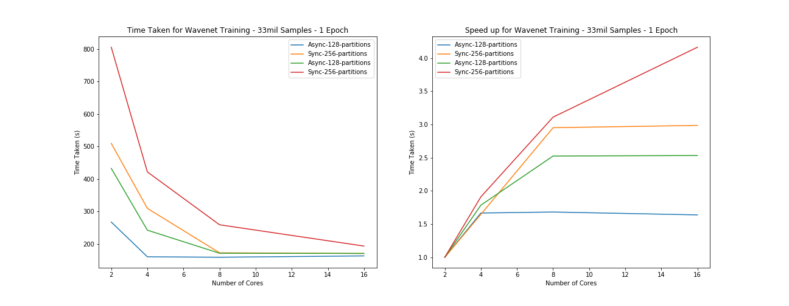

layout: page
title: "AWS Model Parallelization"
permalink: https://haydensansum.github.io/CS205-Waveforms/aws-model-parallel.html

## Aims

As was quickly found during local (on personal laptop) training whilst building and setting up the modeling code. A Wavenet architecture is not something that trains quickly or easily. Based on the original paper (https://arxiv.org/abs/1609.03499) they state that for music generation the model should be able to span approximately 1 second of audio. In our data processing we decided to downsample songs to 8k samples per second (from 44100) which left them sounding slightly fuzzy but otherwise intact. In doing so this meant our Wavenet architecture (see the Wavenet section for more details) would need 8192 input samples (it must a value of 2^n).

This requires a network with 8 stacks of 10 layers (each layer containing three separate convolutional filters). As can be seen this alone gives almost 250 different convolution filters which must step over each of the song sample data points (8192) every time it requires training. Whilst a single pass of data through the network is sequential and cannot be parallelized, each input sample to the model is independent and hence more open to being divided out. The major technical barrier here is that the gradients in a traditional neural network are updated a step at a time (gradient descent) where each step adds more information to the value of the last. In a parallel sense this isn't ideal.

Our aim is therefore to speed up the training of the Wavenet model by splitting the gradient descent process. Hence we wish to split the training process out into multiple batches and recombine the results in a cohesive way. There are papers demonstrating the feasibility of this approach (https://research.google/pubs/pub40565/) using methods such as Downpoor SGD and Hogwild. The concept is relatively simple - the model and a data chunk are distributed out to a worker where it trains on that chunk until it has a set of gradients. This is performed concurrently on all workers and then the gradients are all sent back to the master node which than uses a weighted update process to combine the individual gradients. This can either be performed synchronously or asychronously (aka hogwild which interestingly removes read/write locks). 

Reference - https://www.semanticscholar.org/paper/Large-Scale-Distributed-Deep-Networks-Dean-Corrado/3127190433230b3dc1abd0680bb58dced4bcd90e

## Approach

This is a daunting task in theory, building a working the Wavenet model is not trivial neither are the data processing requirements and pipelining together. A lot of the heavy lifting however has already been provided by a Keras extension named Elephas. Leveraging the power of this package (which has implemented the Downpoor-SGD approach from the above paper and also a Hogwild approach which is also popular) allows us to focus on tuning the parameters for optimum performancing and getting the most out of the model.

This falls under the big compute model when considering the parallelization. The data is being distributed out to the different workers which then return results and syncrhonize. As each worker can act independently, especially if training asynchronously we would expect the speed up to be high as the majority of the process can be done in parallel (computing the gradients per data batch). This will entirely depend however on the network connection speed as the data transfer (I/O) between worker and master is likely to be the major bottleneck. There is also a portion of sequential code (in sychronous mode) as the master computes the gradient updates although this is not true for asynchronous or hogwild.

In order to optimize training as much as possible we attempted to outsource all of the data processing requirements into the data preprocessing section and hence leave the model free to grab and utilize data easily from the RDD. Due to the high number of output channels (256) and large dimensions of each chunk of data (8192) the ideal representation for this would be an array (such as a numpy array) but due to the large individual sizes of each array we wished to leverage a flat binary RDD structure which does not store the one hot encoding directly. As a compromise, the majority of the data processing was offloaded to preprocessing but the onehot encoding and converting to numpy.array was performed as part of the model training flow. 

Based on the number of partitions the data would then be split into chunks which are distributed out to the remote worker nodes as requested. The number of partitions is an important tuning factor as too many chunks will cause the process to be slow due to excessive file transfer back and forth between Worker nodes which will finish training faster due to the smaller size of the data. In order to ensure this was the case we ran a number of speed tests below, we wanted to check a number of factors:

1. Effect of Number of Workers
2. Effect of different sizes of data partition
3. Asynchronous vs synchronous update mode for the gradient descent
2. Effect of parallelizing across clusters

Below are the results from training the model with a number of different parameters, as described.

## Timings

Testing parameters - batchsize = 64, data size = 8songs divided into approx 1000 chunks per song (8000) of 4096 samples (coarse for our purposes but okay for testing) - 1 epoch 

| Mode: ->       | Asynchronous | Asynchronous | Synchronous | Synchronous |
|----------------|--------------|--------------|-------------|-------------|
| Partitions: -> | **128**          | **256**          | **128**         |  **256**         |
| 2              | 4m27.339s    | 8m29.520s    | 7m12.556s   | 13m25.471s  |
| 4              | 2m40.442s    | 5m9.513s     | 4m2.362s    | 7m1.680s    |
| 8              | 2m39.018s    | 2m52.655s    | 2m51.345s   | 4m18.976s   |
| 16             | 2m43.215s    | 2m50.652s    | 2m50.806s   | 3m13.467s   |

## Results
From the results above we can see that there is a general trend of a speed up but that it is not linear and appears to be bounded around 2minutes and 50 seconds. What appears to be happening here is a case of `Amdahl's law` where the speed up is limited by the proportion of code which is parallelizable hence any further number of cores above this limit adds no value. This indicates strongly that the model training itself is not being correctly parallelized by the Elephas extension as there should be a relatively small amount of sequential overhead in an idealized version of this process, mostly I/O based in communicating gradient updates. What we suspect is happening therefore is that if the number of nodes is too small it doesn't load (one hot encode) the data quickly enough to supply data to the Elephas training cycle which gets held up. Once there is enough compute to complete the data processing prior to the model fitting time, the process doesn't speed up - hence it is not parallelizing correctly. This does however demonstrate that there are some limitations in having the one-hot encoding in the model training step rather than the preprocessing step as it then takes around 4 cores in asynchronous mode (128 partitions) or 16 cores in synchronous mode.

As the number of partitions increases we can clearly see the process gets much slower which matches what we would expect to see. It is more efficient to have fewer batches of data, that are larger and hence reduce I/O overheads. The issue with this however is that due to the large size of the data, any fewer paritions and the data size became too large to pass between the master and worker nodes and would cause Java Heap errors. We determined that around 100 paritions was the ideal number to allow for efficient processing but avoid local memory issues. Notice also that we had to reduce the network size to only span 4096 sample points in order to allow it to train.

Overall therefore the parallelization of the model fit has not worked as intended but the model does train, albeit not that fast which is a marked improvement over the local processing mode. Running locally the model was limited to 1024 data points and running in this pipeline, with the efficient RDD batching of data allows for a much larger and more stable model fit. In the end we ran the model fitting for 7 hours and achieve a loss of around 2.3 (categorical cross entropy).

## Issues/Observations

Due to the lack of speed up shown on local mode (see timing below), we determined it was not worth attempting to parallelize across clusters with the added overheads given that it was not yet working as intended in local mode. We instead focused efforts on debugging and attempting to solve the issues here. Unfortanately we ran out of time and this is our high priority next step for taking this forward.

Reworking the data pipeline is also imperative in order to allow for the onehot encoding to be performed prior to the model training segment and potentially this means uncovering a more efficient method of data storage, or at least more flexible. A next step we wish to attempt is utilizing Spark ML Dataframes to store the information rather than RDDs.

One interesting point is the difference between setting the number of workers within Elephas and setting the number of partitions within the data manually. Both variables achieve the same result - splitting the data out into chunks which can be parallelized across the different workers as sonce they are free (either synchronously where they are assigned in order or asynchronously when they take data when ready). This is an important tuning parameter as having too many data batches which are too small can reduce efficiency.

Exploring the Elephas source code, setting the number of workers actually performs a repartition of the RDD data structure before mapping a Worker Class to each chunk. Hence this is functionally equivalent to manually setting the partitons outside of the Elephas function call as the Worker Classes will still be distributed the same. What is most strange however is that it appears to modify the behaviour of the model training in that it would appear to not update the gradients at all when set within the elephas function wrapper whereas set in the raw data partitions would work. We are unsure as to why this issue occurs but again would like to investigate further.

