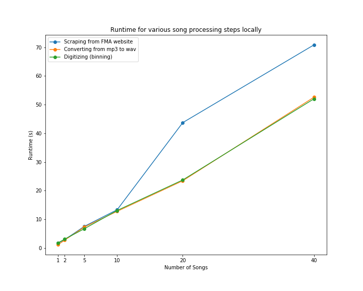
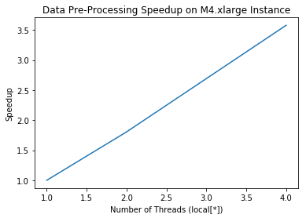
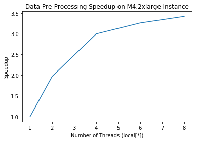
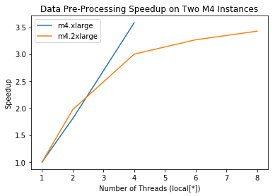

# Data Parallelization

The task of obtaining the required training data for our neural network involved multiple computationally intensive steps that needed to work on large amounts of data. In order to prepare the data, we needed to scrape the music files from FMA, and then perform conversions and other preprocessing steps to prepare it in a compatible format for our wavenet model. These complex processes - including decompressing, downsampling, normalizing and digitizing - that would usually take a long time to run, and we believed these tasks are reasonably parallelizable and can be executed in a way to boost overall performance, and be ready for modeling. We aimed to parallelize the preprocessing of our `mp3` files using `Spark` on AWS EMR. Spark specializes in general-purpose big dataflow processing - and does so using RDDs which are distributed and allow transformations to be performed across them in parallel in a pipelined manner.

## Approach

### Data Scraping

In order to generate new songs, we needed to have a very large dataset of audio for our neural network to train on. In order to easily obtain these songs, we found a large bank of songs online from FMA (Free music archive). As these `mp3` songs are free to download and come from a variety of genres, they seemed ideal for our project. In order to retreive them, we built a processing script utilizing `Beautiful Soup` to scrape these songs from the website and download them. However, this stage was a bit of a bottleneck in our pipeline which had to be performed far in advance, as we realized that it would not be possible to parallelize this process.

After implenting a version of the code locally, for diagnostics and benchmarking, we shifted the process to AWS EMR so as to scrape the large amounts of data directly into an `S3` bucket. We chose to scrape 1000 songs, so at about 10 MB each, this amounted to 10GB of data in total. However, since we were requesting from the webserver, there was an API limit that restricted any kind of parallelization. The website would allow scraping of a batch of songs before buffering for 30 seconds, limiting speeds. This resulted in a total scraping time of around 1 hour.

## Processing

Generally audiofiles are compressed in certain formats like `mp3`, however this format doesn't lend itself well to extracting the raw audio data or performing computaitons on. To get the mp3 in a useful data format, we must convert it to a format like `wav` which is a container file often used for lossless audio. Though initially `mp3` files are around 10 MB,  their `wav` counterparts are around 20-30 MB each. Working with many songs of this type required parallelized processing. We did this by parallelizing across song files in `pyspark`  that are read in from HDFS. 

First, in order to do the conversion from mp3 to wav, we use the `pydub` audio manipulation package to convert an mp3 into an audiosegment. From the audiosegment we were able to convert to wav, however this required writing out to a file. In order to combat the issue that this would present on spark, we wrote to a tempfile variable, which we then read back in directly. We then used `scipy`'s wavfile package in order to convert this wav data into a numeric data format that can be manipulated and processed in parallel before being fed to the model. As this was using `numpy`, we realized that we needed to convert to arrays for the RDDs to better work with the data for parallelization. 

Following this conversion, we pipelined the RDDs though a series of 2 other mapping functions which performed computations on the songs, which could reach array sizes of around 1.4 million. First, the arrays were downsampled using the `resampy` package (which also caused many issues installing in a reproducable manner on EMR) which uses a low pass filter, to reduce down to a fewer number of overall datapoints for each song — bringing the sampling from 44kHz to 8kHz. Then the song was then `digitized` to convert the continuous audio data values into bins with 256 channels after being scaled. Therefore each datapoint would take on 1 of 256 possible linearly spaced float values between -1 and 1. `Mu's law` was also used here as informed by the paper to improve upon this linear spacing for more realistic audio compression as heard by humans. 

After realizing how large our output data would be even after processing, we decided to only take the left audio channel for these songs to reduce the overall datasize. We also investigated various methods of saving out these very large amounts of data to be saved and read in for modeling later. After realizing that textfiles were not feasible, we opted to save as `pickle` — for binary, compressed representation.

Here, we opted to use `pyspark`'s direct `RDD`s, as opposed to the dataframe abstraction as it didn't map particularly well to the attribute-based framework of features in each column - and we decided not to contain very large lists in each cell. As we are not directly reading from a single document/textfile, the parallelization wasnt computed directly from filesize based of `HDFS` blocksize. Instead, we investigated a few parameters for the number of partitions during parallelization. In the end we decided to have it be determined automatically by the system at runtime. 

We were able to implement a version that parallelizes consistently in localmode using this pipeline after loading the files into HDFS. In local mode, we define the number of threads created to process the tasks parallelized across. We investigated a series of increasing thread counts across 2 different EMR instance types as outlined below. However, unfortunately, we were unable to robustly implement clustermode for this implementation. Since our pre-processing required multiple packages and libraries be imported, unfortunately, the worker nodes that were distributed to in the parallelization were unable to load in the packages and dependencies from master. To resolve this, we attempted using bootstrap actions on cluster starting to install the same dependencies on all nodes, however, the permissions and different os versions on the workers prevented this from being successful. Instead, we attempted to manually install the dependencies on all nodes separately. However, after this was successful, the workers were somehow unable to access the directory of mp3 files they were parallelized across that was shared in the HDFS between them. This will definitely be something we investigate fixing more robustly in the future.

## Challenges/Issues Faced

* Pydub converts to mp3 only by writing to disk: as we didn't want to engage with unecessary reads/writes during the pyspark parallelization, we instead attempted using a tempfile to minimize this issue
* FFMPEG and Resampy package and dependencies: it was more challenging to import these packages on EMR master due to conflicting versions and lack of apt-get on EMR
* Lack of S3 access: we had extensive, ongoing difficulties directly accessing files in shared S3 bucket from EMR master node in pyspark. We were unable to get in-script access to `s3://` , and were forced to load onto master pre-emptively rather than accessing directly from S3. Additionally, working collaboratively was very difficult with S3 - even when user canonical id's were shared and given access to resources, different team members were locked out from accessing or writing files in our shared bucket.
* Inconsistent access of HDFS: we had very strange issues with being able to write into and access HDFS from the master node. Even after putting the files we wanted to work with/read from in the hadoop filesystem, pyspark was very inconsistent in being able to read from there and write back out to the system. It very frequently defaulted to working only on the home directory outside HDFS. As this seemed to happen arbitrarily with every new instance we spun up, we resorted to creating bash scripts to check on the validity of the HDFS on the node we had logged into - for access issues. This challenge was coupled with the S3 bucket access issue — making it challenging to figure out how to robustly access our files.
* Saving out filesize issues: resolved by saving un-coalesced pickle files to be read into wavenet modeltraining
* Cluster-mode AWS difficulties with packages, dependencies, access to files

## Results

**Local mp3 Processing Runtimes**

Here, we can see near linear increase in runtime when processing an increasing number of songs locally: for both converting from mp3 to wav, as well as performing digitizing to bin the results. However, we can see that scraping the mp3 files from the FMA website has a larger runtime increase from 10 to 20 songs being scraped. This is likely due to bandwidth or API restrictions from sending requests to the site. This profiling showcases an O(n) runtime, that we believed could be sped up if run in parallel on spark.

**Preprocessing Benchmarks**

<u>M4.XLarge</u>

| local[1]   | local[2]   | local[4]  |
| ---------- | ---------- | --------- |
| 701.927323 | 388.934172 | 196.20376 |

<u>M4.2XLarge</u>

| local[1]  | local[2]   | local[4] | local[6]   | local[8]   |
| --------- | ---------- | -------- | ---------- | ---------- |
| 666.74988 | 338.388524 | 222.46   | 204.363901 | 194.871871 |

From these results, we can see a very strong speedup upto 3.5x serial on the M4.2xlarge instance. We can see that as the number of local threads increases, so does the speedup relative to on a single thread. However, towards the end this begins to plateau off. This is in accordance with the principles of Amdahl's law, as this code's overall speedup is limited by the proportion that is paralellizable and by what is inherenty serial, leading to this plateau. We suspect that the serial section may stem from read/write actions that must be performed in the mp3 to wav conversion.

Results from the M4.xlarge instance are somewhat similar, actually showing slightly better scaling initially, however we do not have enough datapoints from this one to see the plateau which is still inherent to this specific program. We believe that it would likely average out similarly to the trend of the "larger" instance.

