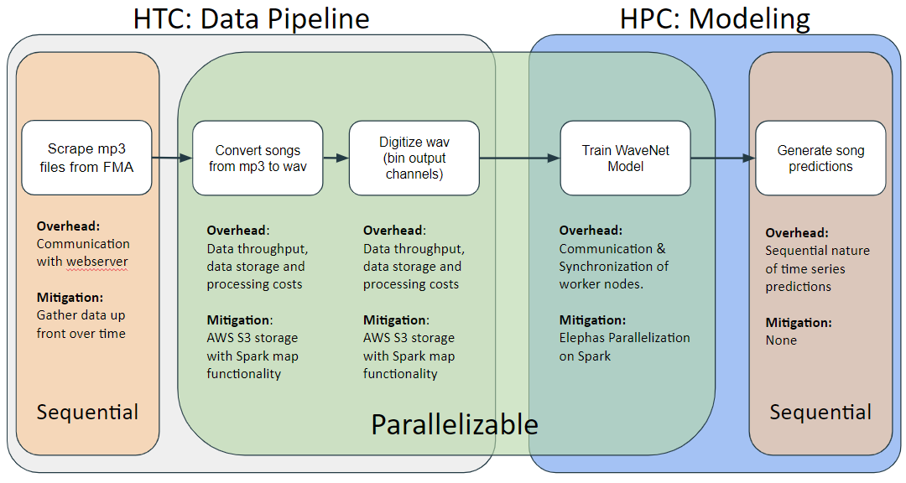

## Motivation

With machine understanding of sound and natural speech having been revolutionized over the last decade, the task of audio generation is an important next step to realizing the long-standing computational dream of enabling human-machine conversation. Despite recent progress, audio generation remains a highly intensive (and slow) task, as it requires both huge amounts of data and complex networks for training. Thus, this task is one of many that sits at the intersection between Big Data and Big Compute. We discuss computational infrastructure for song generation, an instance of the broader task of audio signal synthesis, which aims to mitigate the computational costs of this task.

## Big Data

Our model must be built on thousands of raw song waveforms which range in size up to 4GB per song. Each song contains over 44,000 sample points per second with 16 bits per sample (over 65,000 discrete output channels). Training an effective model thus requires gathering thousands of unique songs, i.e. TBs of data. Moreover, several preprocessing operations must be performed on each song, including file conversion from mp3 to wav form, downsampling, binning (digitizing to collapse the number output audio channels), and splitting into smaller chunks to speed up new song generation. These operations are not particularly complex, and fit well into a Spark MapReduce framework on AWS EMR to parallelize the execution of these operations across all songs.

## Big Compute

Our model (described in the Wavenet section) is a fully convolutional neural network, and directly models audio waveforms, thus having to learn thousands of derivatives. Preliminary profiling showed that it would take 300-500 hours to train on just 8 songs. Moreover, generation is slow, as we go one sample at a time. We therefore must leverage data-parallel training and optimization.

## Pipeline

We aim to mitigate some of these primary overheads through the following pipeline design and model choices.

To address communication limits with the FMA webserver, we scraped song data gradually over time. To combat throughput issues, we will use AWS S3 storage and Spark parallelization on the data processing steps.

In the model training step, Elephas will enable us to train the wavenet model on spark across a cluster of workers. We will mitigate issues of communication and synchronization of the worker nodes by having a master model which sends parameters to workers to train, and then receives them back with write-locks to iteratively update the master parameters of the final model.

However, because of the nature of model, though we are able to train using continuous windows of existing songs, we’ll be unable to reasonably parallelize generation, since we require sequential predictions to be inputs for the next prediction.

