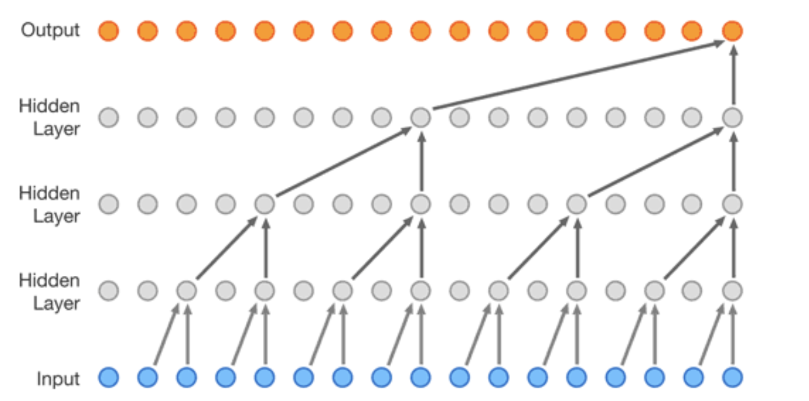
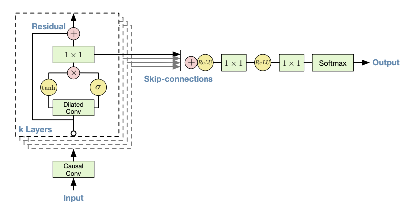

layout: page
title: "Wavenet Model"
permalink: https://haydensansum.github.io/CS205-Waveforms/wavenet.html

## What is Wavenet?

Wavenet is a specific architecture of a fully convolutional neural network, invented by Deepmind for the task of generating realistic sounds. It was originally designed for text to speech to generate human sounding voices but it's potential for other types of audio generation didn't go unnoticed. 

It makes predictions in an autoregressive manner (taking the previous output and feeding in as the next input value) and hence builds up the audio one sample at a time. In our case we wish to utilize a wavenet architecture to generate music, as a very deep and completely convolutional network it is difficult and time consuming to train, hence the need for parallelization. 

For further details on Convolutional Neural Networks if you're not familiar, please see Keras documentation (https://keras.io/api/layers/convolution_layers/)

## How does it Work?

A Wavenet model can be thought of as a stack of interconnected layers, each node within a layer is a combination of exactly two nodes from the previous layer. With each layer you go up, the `dilation` increases and so the nodes which combine together are spaced further apart. This is the incredibly clever trick as it allows for a large receptive field (amount of input samples) very cheaply (in relative terms).

This then follows all the way up the network until the final layer which outputs a prediction value. Below is a diagram which represents the concept, albeit slightly confusingly. If you look closely you'll see the grey lines in the background which show the true underlying structure of the network. For each input chunk the model outputs the same number of values on the output and hence can be trained as if an autoencoder with the target labels being in the input data.

*Reference* - (https://deepmind.com/blog/article/wavenet-generative-model-raw-audio)

## Building Blocks

To really understand what is going on we need to breakdown a few of the key terminologies used when looking at wavenets and consider the core components used within.

#### Atrous Causal Convolutional Filter

As mentioned briefly above, each node is a combination of two nodes from the previous later - hence a convolutional layer with kernel size = 2. The convolution means that the same filter is applied and trained across all of the data points (almost as if sliding it across the input data two samples at a time). This alone however is just a standard convolutional neural network, the power of the Wavenet comes from the dilation (Atrous). The dilation rate is increased by a factor of 2^n for each increasing layer hence between the first and second layer adjacent points are combined, at layer 2 it is every other point, layer 3 is every 4, then 8, 16, 32... As can be seen it rapidly increases whilst keeping the simple size 2 kernel. This therefore means the final predicted data point on the far right can see the very first data point at the bottom left. The rule of thumb for building these layers it that the number of layers N = log2(input_data_window).

Additionally there is concept of causality. In a traditional convolutional layer it doesn't matter in which order the inputs arrive (aka in a image you care about all surround pixels equally). In song or audio generation however **only** the data points further back in time should be leveraged. This causality is vital to ensure generated songs move forward in time.

These layers exist as part of the Tensorflow Keras pipeline and hence can be incorporated directly to the rest of the Keras modeling components and tools.

#### Sigmoid - Tanh Gated Unit

The above concept of stacking layers is correctly although over simplified. Each layer actually consists of a pair of layers (with the same number of filters) where one has a sigmoid and the other a tanh activation function (as shown in the diagram below from Deepmin's published paper). This acts much like a gate in an LSTM or other Recurrent Network in that the sigmoid can scale up or down (0->1) the importance of the current input values. The tanh then effectively provides the audio signal (-1 to 1) and the multiplication of the two gives the scaled output.

*Reference:* https://arxiv.org/pdf/1609.03499.pdf

## Training a Wavenet

Training a wavenet is the slowest part of the process. To have a functioning music generation model the recommended number of input data points is 1 second, even heavily downsampling normal WAV music files this leads to 8192 input data points (2^13). Hence you might assume there would be 13 layers. Unfortunately continually adding too many dilated layers begins to dilute the sound too much as the data points become unrelated. Hence in practice the approach is to stack groups of layers (referred to through our codebase as stacks) on top of eachother. This additively increases the receptive field. Each stack is 10 layers (1024 field) and hence we require 8 stacks. This a network which is at least 80 layers deeps where each layer is actually a pair of convolutional layers. This starts to uncover the extent of the difficulty in training this sort of model.

To begin with we designed and build a local data pipeline using a custom data generator which yields one input sample at a time to the model fitting. This is optimal as it has reduced memory footprint which was important for local testing. To give an idea of scale, fitting just a single stack for a single epoch took over 2 hours (and a very hot CPU). Achieving parallelization is therefore of paramount importance to develop a working model in any reasonable timeframe.

## Predicting Songs

The final step of the Wavenet model is taking the trained model and producing songs; which it turns out is an artform in itself. The model outputs a softmax for each input data point and generally we're interested in the latest time step. This output contains a channel of probabilities which represent all the possible values the wave could take on next. The problem here is that if you just take the single highest probability the network may end up getting stuck as samples next to each other will often have similar values causing the prediction to stagnate. To avoid this the softmax output can be used as a weighted distribution from which to sample. Its worth noting that whilst predictions cannot be sped up due to their autoregressive nature, they are very slow. Generating a 10 second clip of audio took around 2-3 hours.